# SLAPP-106 Documentation

This repository contains visual documentation for various app events and user interactions.

## Table of Contents

- [App Lifecycle Events](#app-lifecycle-events)
- [Network Events](#network-events)
- [User Authentication](#user-authentication)
- [User Actions](#user-actions)
- [Screen Views](#screen-views)

---

## App Lifecycle Events

These events track the various states of the application lifecycle.

### App Did Finish Launching

### App Did Become Active

### App Will Resign Active

### App Did Enter Background

### App Will Enter Foreground

---

## Network Events

These events monitor network connectivity and quality changes.

### Network Changed
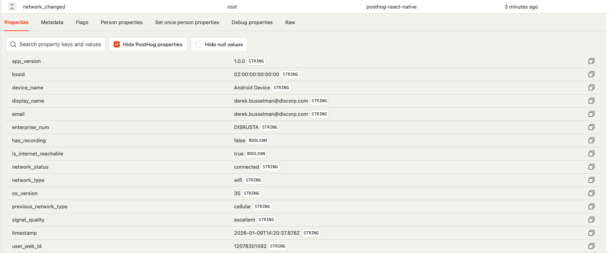

### Network Connected - WiFi
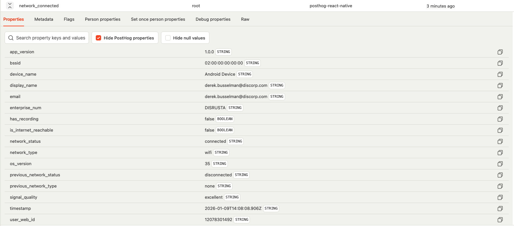

### Network Connected - Cellular

### Network Disconnected
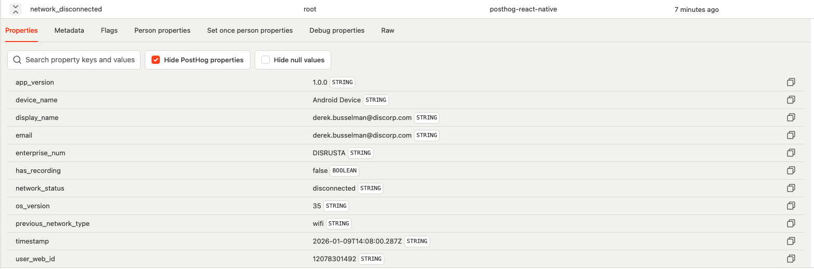

### Network Quality Updated
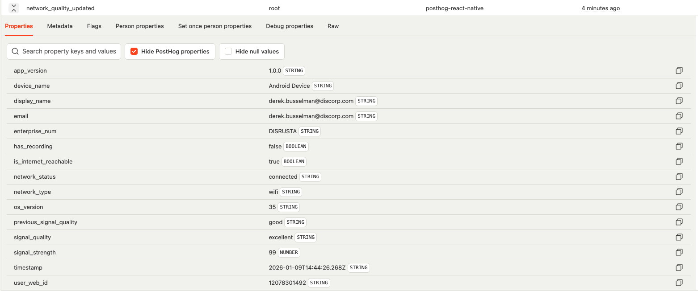

---

## User Authentication

These events track user login and logout activities.

### User Logged In

### User Logged Out

---

## User Actions

These events capture various user interactions within the application.

### Button Click
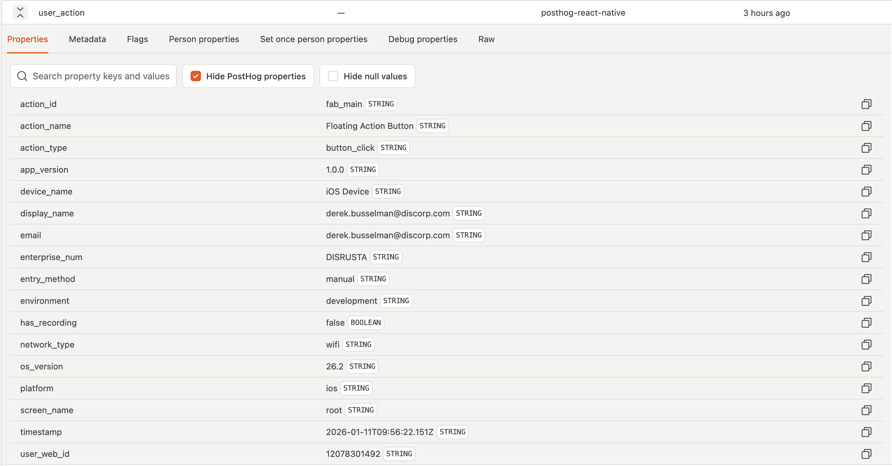

### Content Scroll
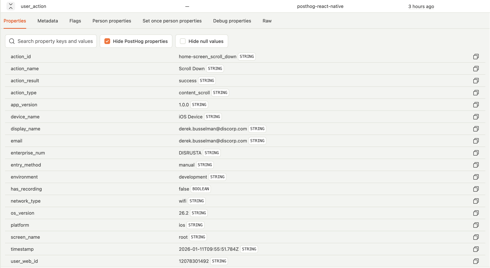

### Link Click
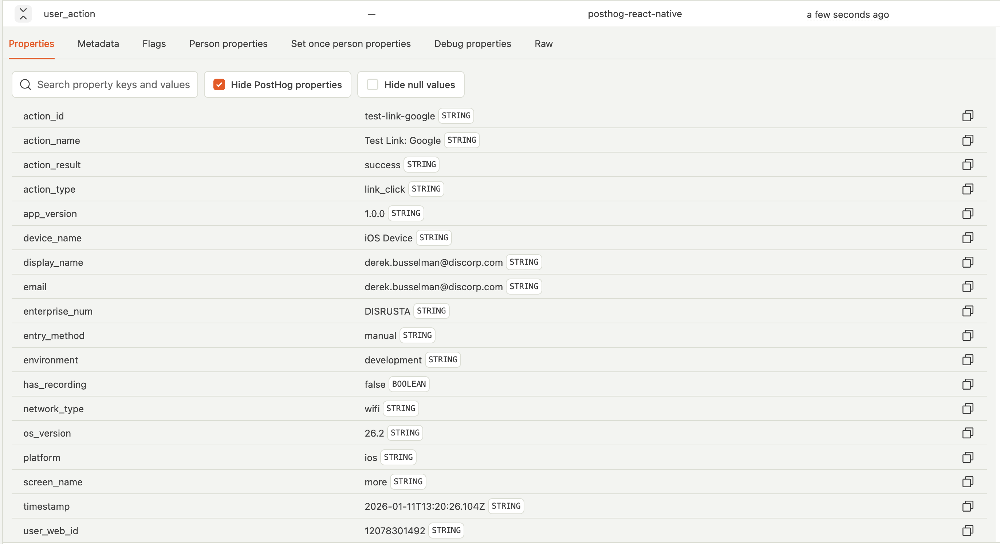

### Radio Button
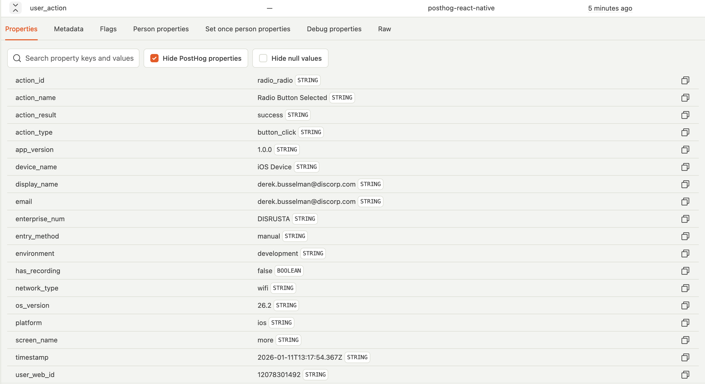

### Tab Navigation
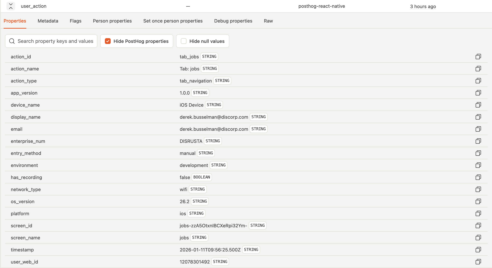

### Toggle Button
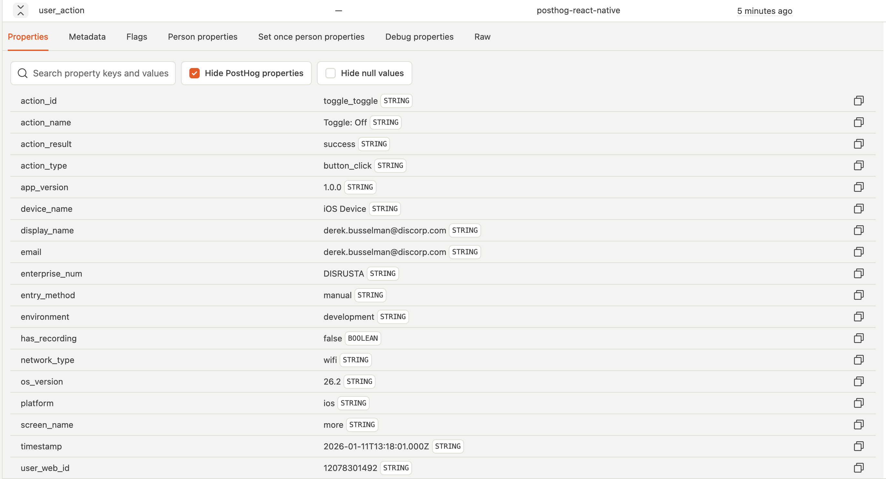

---

## Screen Views

### Screen View
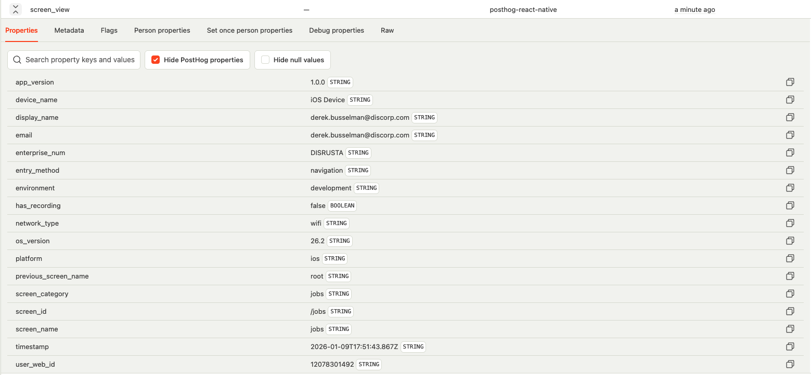

---

## Notes

All images in this repository are screenshots documenting various events and interactions that can be tracked within the application. These visual references help understand the different types of events that are monitored and logged.
