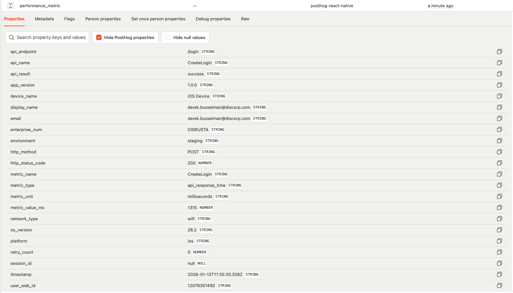
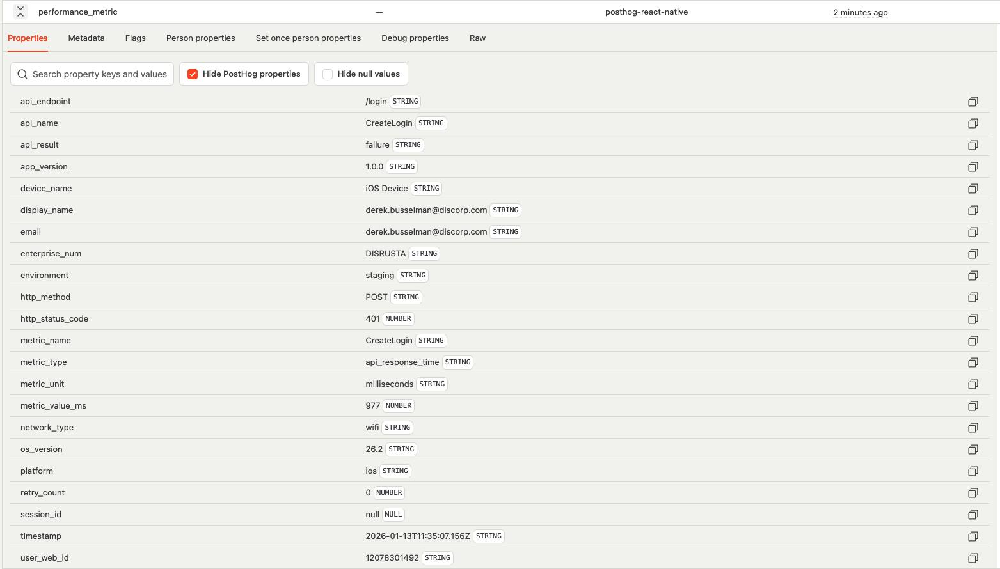
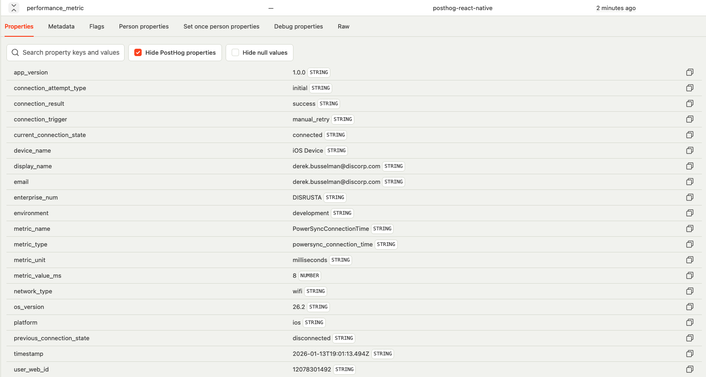

# SLAPP-106 Instrumentation Ticket: STATUS

This repository contains visual documentation for various app events, user interactions, and performance metrics that are tracked within the application.

## Table of Contents

- [App Lifecycle Events](#app-lifecycle-events)
- [Network Events](#network-events)
- [User Authentication](#user-authentication)
- [User Actions](#user-actions)
- [Performance Metrics](#performance-metrics)
- [PowerSync Events](#powersync-events)
- [Screen Views](#screen-views)

---

## App Lifecycle Events

These events track the various states of the application lifecycle.

### App Did Finish Launching

### App Did Become Active

### App Will Resign Active

### App Did Enter Background

### App Will Enter Foreground

---

## Network Events

These events monitor network connectivity and quality changes.

### Network Changed

### Network Connected - WiFi

### Network Connected - Cellular

### Network Disconnected

### Network Quality Updated

---

## User Authentication

These events track user login and logout activities.

### User Logged In

### User Logged Out

---

## User Actions

These events capture various user interactions within the application.

### Button Click

### Content Scroll

### Link Click

### Radio Button

### Tab Navigation

### Toggle Button

---

## Performance Metrics

These events track application performance including load times and API response times.

### App Load Time

### API Response Time - Success

### API Response Time - Failure

---

## PowerSync Events

These events track PowerSync connection status, synchronization states, and performance metrics.

### PowerSync Connection Time

### PowerSync Connection Status - Connected

### PowerSync Connection Status - Disconnected

---

## Screen Views

### Screen View

---

---

## Summary

This documentation covers the following implemented instrumentation features:

- ✅ **App Lifecycle Events** - Complete tracking of app state transitions
- ✅ **Network Events** - Comprehensive network connectivity monitoring
- ✅ **User Authentication** - Login and logout event tracking
- ✅ **User Actions** - Various user interaction tracking (buttons, scrolls, links, etc.)
- ✅ **Performance Metrics** - App load time and API response time tracking
- ✅ **PowerSync Events** - PowerSync connection status and connection time tracking
- ✅ **Screen Views** - Screen view tracking

All images in this repository are screenshots documenting various events and interactions that can be tracked within the application. These visual references help understand the different types of events that are monitored and logged.
